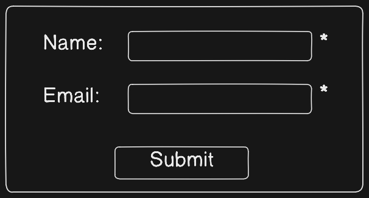

# 18-Mars-2025
# PHP

Definition: Server Side Scripting Language

1. Collect form data
2. Create, Update, Delete  file on Server
3. Update database
4. Dynamic webpage
5. Provide response to client

## Server: (To run php we need a server)
    Apache - Web Server
    All webserver runs on : 8084
    Eg:
        1. Glassfish: 8080
        2. nginx: 8080
        3. Apache: 8080
    Default address: http://loaclhost:8080
## Database:
    Mysql(Database Server):3306

### FileSystem vs DBMS


# PHP Code Structure
* HTML
* CSS
* JS
* PHP

# 19-Mars-2025

# Assessment on PHP

    1. Variables
    2. Scope of Variables
    3. Datatypes

## Examples
```php
<?php
$name = "Ravi";
$age = 24;
echo ${name};
echo ${age};
?>
```

# **Scope of Variables in PHP**

PHP has different types of variable scopes, which define where a variable can be accessed within a script. The three main types are:

1. **Local Scope**
2. **Global Scope**
3. **Static Scope**

---

## **1. Local Scope**
Variables declared inside a function are considered **local** to that function and cannot be accessed outside of it.

### **Example of Local Scope**
```php
<?php
    function myTest() {
        $x = 10; // Local variable
        echo "Value of x: $x <br>"; // Accessible within the function
    }

    myTest();
    
    // echo $x; // ERROR: Undefined variable $x because it's local to the function
?>
```
### **Explanation:**  
- `$x` is a local variable to `myTest()`, so it cannot be accessed outside the function.

---

## **2. Global Scope**
A variable declared **outside** of a function is considered **global**. By default, global variables **cannot be accessed inside functions** unless explicitly specified using the `global` keyword or `$GLOBALS` array.

### **Example of Global Scope**
```php
<?php
    $y = 90; // Global variable

    function myTest() {
        global $y; // Accessing global variable inside function
        echo "Value of y: $y <br>";
    }

    myTest();
    echo "Value of y outside function: $y <br>"; // Accessible here
?>
```
### **Explanation:**  
- `$y` is defined outside the function, making it a global variable.
- Inside `myTest()`, we use `global $y;` to access the global variable.

### **Using `$GLOBALS` Array**
Instead of `global`, you can also use `$GLOBALS` array:
```php
<?php
    $a = 50;

    function test() {
        echo "Value of a using GLOBALS: " . $GLOBALS['a'] . "<br>";
    }

    test();
?>
```
### **Explanation:**  
- `$GLOBALS['a']` gives access to the global variable `$a` inside the function.

---

## **3. Static Scope**
Normally, when a function ends, its local variables are destroyed. However, if a variable is declared **static**, it retains its value between function calls.

### **Example of Static Scope**
```php
<?php
    function countCalls() {
        static $count = 0; // Static variable
        $count++;
        echo "Function called $count times <br>";
    }

    countCalls();
    countCalls();
    countCalls();
?>
```
### **Explanation:**  
- `$count` is declared as `static`, so it is not destroyed after the function call.
- It retains its value between calls and keeps incrementing.

---

## **Summary Table**
| Scope    | Defined Inside Function? | Accessible Outside Function? | Retains Value Between Calls? |
|----------|-------------------------|------------------------------|------------------------------|
| **Local**  | ✅ Yes  | ❌ No | ❌ No |
| **Global** | ❌ No  | ✅ Yes (outside function) | ❌ No |
| **Static** | ✅ Yes  | ❌ No | ✅ Yes |

---
# DataTypes

* String | Eg:- $x = "Ravi";
* Int   | Eg:- $x = 20;
* float | Eg:- $x = 25.50;
* boolean | Eg:- $x = true
* Array | Eg:- $x = ("China", "Hatorki","Jani");

# PHP var_dump() Function

The var_dump() function in PHP is used to display structured information about variables, including their type and value.
```php
$x = "Hatorki"
var_dump($x) // it will give "sting" as output
```

# 20-March-2025

# Methods: string manipulation on string str
* strlen()
```php
$str = "Hello, World!";
echo strlen($str); // Output: 13
```
* str_word_count()
```php
$str = "Hello, World!";
echo str_word_count($str); // Output: 2
```
* str_pos()
```php
$str = "Hello, World!";
echo strpos($str, "World"); // Output: 7
```
* strtolower()
```php
$str = "Hello, World!";
echo strtolower($str); // Output: hello, world!
```
* strtoupper()
```php
$str = "Hello, World!";
echo strtoupper($str); // Output: HELLO, WORLD!
```
* strrev()
```php
$str = "Hello, World!";
echo strrev($str); // Output: !dlroW ,olleH
```
* substr()
```php
$str = "Hello, World!";
echo substr($str, 7, 5); // Output: World
```
* str_replace()
```php
$str = "Hello, World!";
echo str_replace("World", "PHP", $str); // Output: Hello, PHP!
```

# Arithmetic, Assignment, and Logical Operators in PHP

Arithmetic operators are used to perform mathematical operations on numerical values in PHP.

## List of Arithmetic Operators

| Operator | Name           | Description                             | Example    | Output      |
| -------- | -------------- | --------------------------------------- | ---------- | ----------- |
| `+`      | Addition       | Adds two numbers                        | `$a + $b`  | `30`        |
| `-`      | Subtraction    | Subtracts one number from another       | `$a - $b`  | `10`        |
| `*`      | Multiplication | Multiplies two numbers                  | `$a * $b`  | `200`       |
| `/`      | Division       | Divides one number by another           | `$a / $b`  | `2`         |
| `%`      | Modulus        | Returns the remainder of division       | `$a % $b`  | `0`         |
| `**`     | Exponentiation | Raises a number to the power of another | `$a ** $b` | `100000000` |

## List of Assignment Operators

Assignment operators are used to assign values to variables in PHP.

| Operator | Name              | Description                                      | Example    | Equivalent To  |
| -------- | ----------------- | ------------------------------------------------ | ---------- | -------------- |
| `=`      | Assignment        | Assigns right operand to left operand            | `$a = $b`  | `$a = $b`       |
| `+=`     | Addition Assignment | Adds right operand to left operand and assigns  | `$a += $b` | `$a = $a + $b`  |
| `-=`     | Subtraction Assignment | Subtracts right operand from left operand and assigns | `$a -= $b` | `$a = $a - $b`  |
| `*=`     | Multiplication Assignment | Multiplies left operand by right operand and assigns | `$a *= $b` | `$a = $a * $b`  |
| `/=`     | Division Assignment | Divides left operand by right operand and assigns | `$a /= $b` | `$a = $a / $b`  |
| `%=`     | Modulus Assignment | Takes modulus using two operands and assigns    | `$a %= $b` | `$a = $a % $b`  |
| `**=`    | Exponentiation Assignment | Raises left operand to power of right operand and assigns | `$a **= $b` | `$a = $a ** $b` |

## List of Logical Operators

Logical operators are used to combine conditional statements in PHP.

| Operator | Name        | Description                                                | Example            | Output |
| -------- | ----------- | ---------------------------------------------------------- | ------------------ | ------ |
| `&&`     | AND        | Returns true if both conditions are true                   | `($a > 0 && $b > 0)` | `true` |
| `||`     | OR         | Returns true if at least one condition is true             | `($a > 0 || $b < 0)` | `true` |
| `!`      | NOT        | Returns true if the condition is false                     | `!($a > 0)`         | `false` |
| `xor`    | XOR        | Returns true if only one condition is true                 | `($a > 0 xor $b < 0)` | `true` |

## Examples in PHP

```php
<?php
$a = 20;
$b = 10;

// Logical AND
$result = ($a > 0 && $b > 0);
echo "Logical AND: ". ($result ? 'true' : 'false') ."\n";

// Logical OR
$result = ($a > 0 || $b < 0);
echo "Logical OR: ". ($result ? 'true' : 'false') ."\n";

// Logical NOT
$result = !($a > 0);
echo "Logical NOT: ". ($result ? 'true' : 'false') ."\n";

// Logical XOR
$result = ($a > 0 xor $b < 0);
echo "Logical XOR: ". ($result ? 'true' : 'false') ."\n";
?>
```

# 21-March-2025

## Conditional Statements

### if...else...
```php
<?php
$age = 20;

if ($age >= 18) {
    echo "You are eligible to vote.";
} else {
    echo "You are not eligible to vote.";
}
?>

```
### if...elseif...else
```php
<?php
$marks = 75;

if ($marks >= 90) {
    echo "Grade: A+";
} elseif ($marks >= 80) {
    echo "Grade: A";
} elseif ($marks >= 70) {
    echo "Grade: B";
} else {
    echo "Grade: C";
}
?>

```
### switch...case
```php
<?php
$day = "Tuesday";

switch ($day) {
    case "Monday":
        echo "Start of the workweek!";
        break;
    case "Tuesday":
        echo "Second day of the workweek!";
        break;
    case "Friday":
        echo "Weekend is near!";
        break;
    default:
        echo "It's a regular day!";
        break;
}
?>

```
## Loops

### While loop
```php
<?php
$count = 1;

while ($count <= 5) {
    echo "Count: $count<br>";
    $count++;
}
?>
```
### do... while loop
```php
<?php
$count = 1;

do {
    echo "Count: $count<br>";
    $count++;
} while ($count <= 5);
?>
```
### for loop
```php
<?php
for ($i = 1; $i <= 5; $i++) {
    echo "Iteration: $i<br>";
}
?>
```
### foreach loop (for Array)
```php
<?php
$colors = array("Red", "Green", "Blue");

foreach ($colors as $color) {
    echo "Color: $color<br>";
}
?>
```

# Data Collection from "Form"
file.html
```php
<html>
    <head><title>Form</title>
    <body>
        <form action="getValidate.php" method="POST">
            Name: <input type="text" id="name" name="name" value="">
            Email: <input type="text" id="email" name="email">
            <button type="submit">
        </form>
    </body>
</html>
```
getValidate.php
```php
<html>
    <body>
        <?php 
            echo "Name= ".$_POST["name"] . "<br>";
            echo  "emailId=" . $_POST["email"] . "<br>";
        ?>
    </body>
</html>
```

# 23-March-2025
## PHP form validation


```php
<html>
    <head>
        <title>Form</title>
    </head>
    <body>
        <form action="<?php echo $_SERVER['PHP_SELF']; ?>" method="POST">
        Name: <input type="text" name="name" value="">
        Email: <input type="text" name="email" value="">
        <input type="submit" value="Submit">
        </form>
    </body>
</html>
```

## Malicious Attack example
link: [http://localhost/index.php/%22%3E%3Cscript%3Ealert('Hacked')%3C/script%3E
](http://localhost/index.php/%22%3E%3Cscript%3Ealert('Hacked')%3C/script%3E)
## which converts into the following
```
<form action="input.php"><script>alert("Hacked")</script></form>
```


## To make our form secure we use htmlspecialchars() and Validate & Sanitize User Input
```php
<html>
    <head>
        <title>Form</title>
    </head>
    <body>
        <form action="<?php echo htmlspecialchars($_SERVER['PHP_SELF']); ?>"  method="POST"> 
        Name: <input type="text" name="name" value="">
        Email: <input type="text" name="email" value="">
        <input type="submit" value="Submit">
        </form>
        <?php
        if ($_SERVER["REQUEST_METHOD"] == "POST") {
            $name = htmlspecialchars(strip_tags($_POST    ["name"]));
            $email = filter_var($_POST["email"], FILTER_SANITIZE_EMAIL);

            echo "Name: " . $name . "<br>";
            echo "Email: " . $email . "<br>";
        }
        ?>
    </body>
</html>
```
```php
<?php
$nameErr="",
$name="",
if(empty($_POST["name"])){
    $nameErr="Name Required";
}else{
    $name=htmlspecialchar($_POST["name"])
}
>
```

# 25-March-2025

# php form validation

### To filter data in php form:
```php
<?php
    if($_SERVER["REQUEST_METHOD"]=="POST"){
        $name=test_form($_POST["name"]);
        $email=test_form($_POST["email"]);
    }


function test_form($data){
    $data=trim($data);
    $data=stripslashes($data);
    $data=htmlspecialchars($data);
    return $data;
}
?>
```
### Another Example
```php
<?php
    // To check for empty fields
    $nameErr=$emailErr="";
    $name=$email="";
    if(empty($name)){
        $nameErr="Name Required";
    }else{
        $name=test_form($name);
    }
    if(empty($email)){
        $emailErr="Email Required";
    }else{
        $email=test_form($email);
    }

    function test_form($data){
        $data=trim($data);
        $data=stripslashes($data);
        $data=htmlspecialchars($data);
        return $data;
    }
?>
```
### For checking for pattern
```php
<?php
    if($_SERVER["REQUEST_METHOD"]=="POST"){
        // For name field
        if(empty($name)){
            $nameErr="Name required";
        }else{
            name=test_form($data);
            if(!preg_match("^[a-zA-Z-']*&/", $name)){
                $nameErr="Only letter and white space required";
            }
        }
        // For email field
        if(empty($email)){
            $emailErr="Name required";
        }else{
            name=test_form($data);
            if(!filter_var($email, FILTER_VALIDATE_EMAIL)){
                $emailErr="Invalid Email Format";
            }
        }
        // For url
        if(empty($email)){
            $urlErr="URL required";
        }else{
            name=test_form($URL);
            if(!preg_match("/\b(?:(?:https?/ftp:\/\/|www\.[a-z0-9+$@#/\%?~=~|...]", $URL)){
                $urlErr="Invalid URL";
            }
        }
    }
?>
```
### Form
```php
<form action="<?php
    echo htmlspecialchar($_SERVER['PHP_SELF']); ?>">
    Name:<input type="text" name="name">*<?php echo $nameErr; ?>
    Email:<input type="text" name="email">*<?php echo $emailErr; ?>
    <button type="submit" value="Submit">
</form>
```
